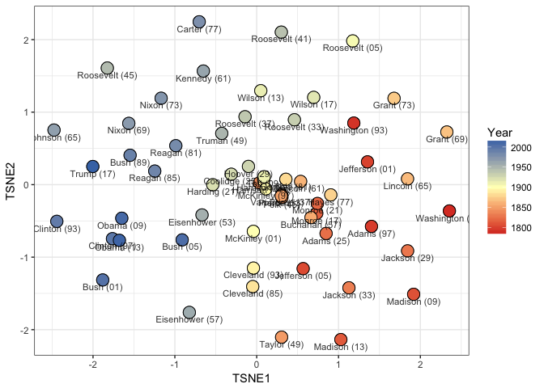

<!-- README.md is generated from README.Rmd. Please edit that file -->
First, load the cleaned data. I've cleaned up the inaguration texts by lowercasing them, removing punctuation and normalizing whitespace. I then stemmed the texts and tokenized them into a document-term matrix using 1-5 grams:

``` r
data(text_matrix)
```

Now we normalize the data for the fact that they documents have different lengths

``` r
text_matrix = text2vec::normalize(text_matrix, "l1")
```

And then we do a tf-idf transformation. We use the L1 norm to normalize the data for the fact that documents have different lengths and then sublinear\_tf because words are log-linearlly distributed:

``` r
tfidf = text2vec::TfIdf$new(norm='l1', sublinear_tf=TRUE)
text_matrix = text2vec::fit_transform(text_matrix, tfidf)
```

Next, we use PCA to project our giant, sparse matrix down into a small, dense matrix:

``` r
model_pca <- prcomp(text_matrix, retx=TRUE, center=T, scale=T)$x
```

And then we do TSNE on the small, dense matrix:

``` r
model_tsne <- Rtsne::Rtsne(
  model_pca, dims=2, initial_dims=ncol(model_pca), 
  check_duplicates=FALSE, pca=FALSE, verbose=FALSE, max_iter=10000,
  perplexity=15, theta=0)$Y
model_tsne <- data.table::data.table(model_tsne)
data.table::setnames(model_tsne, c('TSNE1', 'TSNE2'))
```

Finally, we plot the result.

``` r
library(ggplot2)
data(meta_data)
final_data <- data.table::data.table(
  meta_data,
  model_tsne
)
final_data$Label <- paste0(final_data$President, ' (', substr(final_data$Year, 3, 4), ')')
p1 <- ggplot(final_data, aes(x=TSNE1, y=TSNE2, fill=Year, label=Label)) +
  scale_fill_gradient2(low='#d73027', mid='#ffffbf', high='#4575b4', midpoint=1900) +
  geom_point(pch=21, size=5, alpha=.80) +
  geom_point(pch=21, size=5, colour = "black") +
  geom_text(size=3, vjust=1.5, alpha=.80) +
  theme_bw()
print(p1)
```


